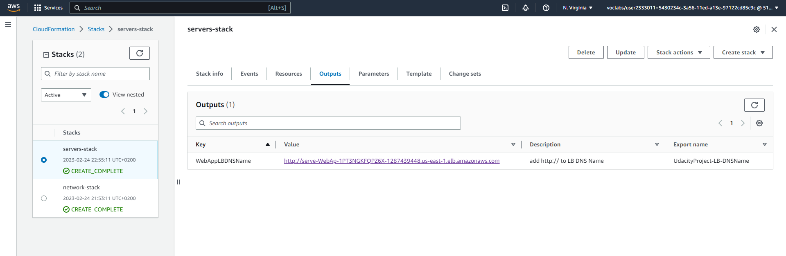

# CloudFormationProject-Udacity

## Project diagram


## To run the project for the first time

1- Run The network stack, and wait untill it's done
```
$ ./create.sh network-stack network.yml network-parameters.json
```
2- Run The servers stack, and wait untill it's done
```
$ ./create.sh servers-stack servers.yml server-parameters.json
```
## Screenshots





## To update the project after creation
```
$ ./update.sh <stack-name> <template-body-file> <parameters-file>
```

## To delete a stack
```
$ ./delete.sh <stack-name>
```
